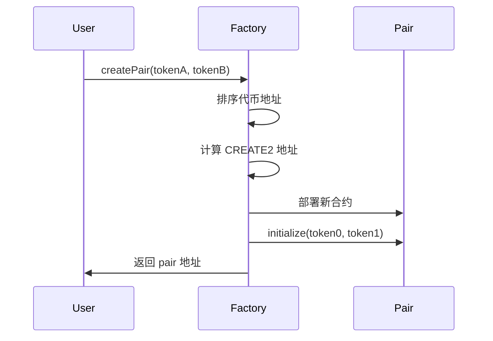
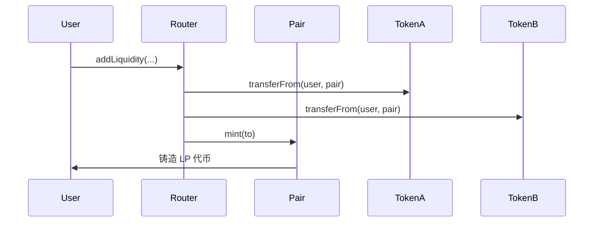
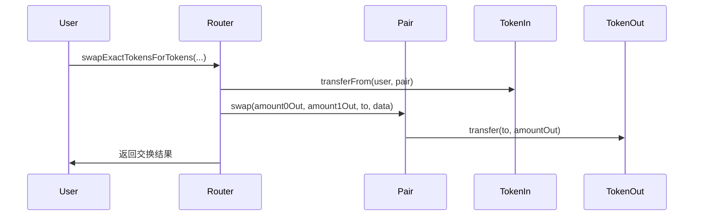

# Uniswap V2 源代码分析与部署指南

## 项目概述

这是一个完整的 Uniswap V2 Fork 项目，包含核心合约和周边合约的源代码分析，以及完整的部署脚本。

## 整体架构

```
uniswap_v2_fork/
├── src/
│   ├── v2-core/           # 核心合约
│   │   ├── interfaces/    # 接口定义
│   │   ├── libraries/     # 核心库
│   │   └── *.sol         # 主要合约
│   ├── v2-periphery/      # 周边合约
│   │   ├── interfaces/    # 接口定义
│   │   ├── libraries/     # 周边库
│   │   └── *.sol         # 路由和迁移合约
│   └── solidity-lib/      # 数学库
└── test/                  # 测试文件
```

### 合约依赖关系

```
UniswapV2Factory
    ↓
UniswapV2Pair (继承 UniswapV2ERC20)
    ↓
UniswapV2Router01/02
    ↓
UniswapV2Library
```

## 核心合约详细分析

### 1. UniswapV2Factory.sol

**功能**: 工厂合约，负责创建和管理交易对

**核心状态变量**:

```solidity
address public override feeTo;           // 协议费用接收地址
address public override feeToSetter;     // 费用设置者
mapping(address => mapping(address => address)) public override getPair;  // 交易对映射
address[] public override allPairs;      // 所有交易对列表
```

**核心方法**:

#### createPair - 创建交易对

```solidity
function createPair(address tokenA, address tokenB) external override returns (address pair) {
    require(tokenA != tokenB, "UniswapV2: IDENTICAL_ADDRESSES");
    (address token0, address token1) = tokenA < tokenB ? (tokenA, tokenB) : (tokenB, tokenA);
    require(token0 != address(0), "UniswapV2: ZERO_ADDRESS");
    require(getPair[token0][token1] == address(0), "UniswapV2: PAIR_EXISTS");

    // 使用 CREATE2 确定性地址创建
    bytes memory bytecode = type(UniswapV2Pair).creationCode;
    bytes32 salt = keccak256(abi.encodePacked(token0, token1));
    assembly {
        pair := create2(0, add(bytecode, 32), mload(bytecode), salt)
    }

    IUniswapV2Pair(pair).initialize(token0, token1);
    getPair[token0][token1] = pair;
    getPair[token1][token0] = pair;
    allPairs.push(pair);
    emit PairCreated(token0, token1, pair, allPairs.length);
}
```

**关键特性**:

- 使用 CREATE2 确保交易对地址确定性
- 自动排序代币地址 (token0 < token1)
- 防止重复创建相同交易对
- 支持协议费用机制

### 2. UniswapV2Pair.sol

**功能**: 交易对合约，实现 AMM 核心逻辑

**继承关系**:

```solidity
contract UniswapV2Pair is IUniswapV2Pair, UniswapV2ERC20
```

**核心状态变量**:

```solidity
uint112 private reserve0;           // 代币0储备量
uint112 private reserve1;           // 代币1储备量
uint32  private blockTimestampLast; // 最后更新时间戳
uint    public price0CumulativeLast; // 代币0累计价格
uint    public price1CumulativeLast; // 代币1累计价格
```

**核心方法**:

#### mint - 添加流动性

```solidity
function mint(address to) external lock returns (uint256 liquidity) {
    (uint112 _reserve0, uint112 _reserve1,) = getReserves();
    uint256 balance0 = IERC20(token0).balanceOf(address(this));
    uint256 balance1 = IERC20(token1).balanceOf(address(this));
    uint256 amount0 = balance0.sub(_reserve0);
    uint256 amount1 = balance1.sub(_reserve1);

    bool feeOn = _mintFee(_reserve0, _reserve1);
    uint256 _totalSupply = totalSupply;

    if (_totalSupply == 0) {
        // 首次添加流动性
        liquidity = Math.sqrt(amount0.mul(amount1)).sub(MINIMUM_LIQUIDITY);
        _mint(address(0), MINIMUM_LIQUIDITY); // 永久锁定最小流动性
    } else {
        // 后续添加流动性
        liquidity = Math.min(
            amount0.mul(_totalSupply) / _reserve0,
            amount1.mul(_totalSupply) / _reserve1
        );
    }

    require(liquidity > 0, "UniswapV2: INSUFFICIENT_LIQUIDITY_MINTED");
    _mint(to, liquidity);
}
```

#### burn - 移除流动性

```solidity
function burn(address to) external lock returns (uint256 amount0, uint256 amount1) {
    (uint112 _reserve0, uint112 _reserve1,) = getReserves();
    address _token0 = token0;
    address _token1 = token1;
    uint256 balance0 = IERC20(_token0).balanceOf(address(this));
    uint256 balance1 = IERC20(_token1).balanceOf(address(this));
    uint256 liquidity = balanceOf[address(this)];

    bool feeOn = _mintFee(_reserve0, _reserve1);
    uint256 _totalSupply = totalSupply;
    amount0 = liquidity.mul(balance0) / _totalSupply;
    amount1 = liquidity.mul(balance1) / _totalSupply;
    require(amount0 > 0 && amount1 > 0, "UniswapV2: INSUFFICIENT_LIQUIDITY_BURNED");
    _burn(address(this), liquidity);
    _safeTransfer(_token0, to, amount0);
    _safeTransfer(_token1, to, amount1);
}
```

#### swap - 代币交换

```solidity
function swap(uint256 amount0Out, uint256 amount1Out, address to, bytes calldata data) external lock {
    require(amount0Out > 0 || amount1Out > 0, "UniswapV2: INSUFFICIENT_OUTPUT_AMOUNT");
    (uint112 _reserve0, uint112 _reserve1,) = getReserves();
    require(amount0Out < _reserve0 && amount1Out < _reserve1, "UniswapV2: INSUFFICIENT_LIQUIDITY");

    uint256 balance0;
    uint256 balance1;
    {
        address _token0 = token0;
        address _token1 = token1;
        require(to != _token0 && to != _token1, "UniswapV2: INVALID_TO");
        if (amount0Out > 0) _safeTransfer(_token0, to, amount0Out);
        if (amount1Out > 0) _safeTransfer(_token1, to, amount1Out);
        if (data.length > 0) IUniswapV2Callee(to).uniswapV2Call(msg.sender, amount0Out, amount1Out, data);
        balance0 = IERC20(_token0).balanceOf(address(this));
        balance1 = IERC20(_token1).balanceOf(address(this));
    }

    uint256 amount0In = balance0 > _reserve0 - amount0Out ? balance0 - (_reserve0 - amount0Out) : 0;
    uint256 amount1In = balance1 > _reserve1 - amount1Out ? balance1 - (_reserve1 - amount1Out) : 0;
    require(amount0In > 0 || amount1In > 0, "UniswapV2: INSUFFICIENT_INPUT_AMOUNT");

    // 确保 k 值不减少 (恒定乘积公式)
    uint256 balance0Adjusted = balance0.mul(1000).sub(amount0In.mul(3));
    uint256 balance1Adjusted = balance1.mul(1000).sub(amount1In.mul(3));
    require(
        balance0Adjusted.mul(balance1Adjusted) >=
        uint256(_reserve0).mul(_reserve1).mul(1000**2),
        "UniswapV2: K"
    );

    _update(balance0, balance1, _reserve0, _reserve1);
}
```

### 3. UniswapV2ERC20.sol

**功能**: LP 代币的 ERC20 实现

**核心特性**:

- 实现 ERC20 标准
- 支持 EIP-712 签名授权
- 包含 Permit 功能

```solidity
// EIP-712 域分隔符
bytes32 public override DOMAIN_SEPARATOR;
// Permit 类型哈希
bytes32 public constant override PERMIT_TYPEHASH =
    0x6e71edae12b1b97f4d1f60370fef10105fa2faae0126114a169c64845d6126c9;
```

### 4. UniswapV2Router02.sol

**功能**: 路由合约，提供用户友好的交易接口

**核心方法**:

#### addLiquidity - 添加流动性

```solidity
function addLiquidity(
    address tokenA,
    address tokenB,
    uint256 amountADesired,
    uint256 amountBDesired,
    uint256 amountAMin,
    uint256 amountBMin,
    address to,
    uint256 deadline
) external virtual override ensure(deadline) returns (uint256 amountA, uint256 amountB, uint256 liquidity) {
    (amountA, amountB) = _addLiquidity(tokenA, tokenB, amountADesired, amountBDesired, amountAMin, amountBMin);
    address pair = UniswapV2Library.pairFor(factory, tokenA, tokenB);
    TransferHelper.safeTransferFrom(tokenA, msg.sender, pair, amountA);
    TransferHelper.safeTransferFrom(tokenB, msg.sender, pair, amountB);
    liquidity = IUniswapV2Pair(pair).mint(to);
}
```

#### swapExactTokensForTokens - 精确输入代币交换

```solidity
function swapExactTokensForTokens(
    uint256 amountIn,
    uint256 amountOutMin,
    address[] calldata path,
    address to,
    uint256 deadline
) external virtual override ensure(deadline) returns (uint256[] memory amounts) {
    amounts = UniswapV2Library.getAmountsOut(factory, amountIn, path);
    require(amounts[amounts.length - 1] >= amountOutMin, "UniswapV2Router: INSUFFICIENT_OUTPUT_AMOUNT");
    TransferHelper.safeTransferFrom(
        path[0], msg.sender, UniswapV2Library.pairFor(factory, path[0], path[1]), amounts[0]
    );
    _swap(amounts, path, to);
}
```

### 5. UniswapV2Library.sol

**功能**: 提供计算和查询功能的核心库

**核心方法**:

#### pairFor - 计算交易对地址

```solidity
function pairFor(address factory, address tokenA, address tokenB)
    internal pure returns (address pair) {
    // 使用 CREATE2 确定性地址计算
    pair = address(uint160(uint256(keccak256(abi.encodePacked(
        hex"ff",
        factory,
        keccak256(abi.encodePacked(token0, token1)),
        hex"96e8ac4277198ff8b6f785478aa9a39f403cb768dd02cbee326c3e7da348845f"
    )))));
}
```

#### getAmountOut - 计算输出数量

```solidity
function getAmountOut(uint256 amountIn, uint256 reserveIn, uint256 reserveOut)
    internal pure returns (uint256 amountOut) {
    require(amountIn > 0, "UniswapV2Library: INSUFFICIENT_INPUT_AMOUNT");
    require(reserveIn > 0 && reserveOut > 0, "UniswapV2Library: INSUFFICIENT_LIQUIDITY");

    uint256 amountInWithFee = amountIn.mul(997); // 0.3% 手续费
    uint256 numerator = amountInWithFee.mul(reserveOut);
    uint256 denominator = reserveIn.mul(1000).add(amountInWithFee);
    amountOut = numerator / denominator;
}
```

### 6. WETH9.sol

**功能**: Wrapped Ether 合约，将 ETH 包装成 ERC20 代币

**核心方法**:

```solidity
function deposit() public payable {
    balanceOf[msg.sender] += msg.value;
    emit Deposit(msg.sender, msg.value);
}

function withdraw(uint256 wad) public {
    require(balanceOf[msg.sender] >= wad, "");
    balanceOf[msg.sender] -= wad;
    payable(msg.sender).transfer(wad);
    emit Withdrawal(msg.sender, wad);
}
```

## 关键算法解析

### 1. 恒定乘积公式 (x \* y = k)

Uniswap V2 使用恒定乘积公式来维持价格平衡：

```solidity
// 在 swap 函数中验证 k 值
uint256 balance0Adjusted = balance0.mul(1000).sub(amount0In.mul(3));
uint256 balance1Adjusted = balance1.mul(1000).sub(amount1In.mul(3));
require(
    balance0Adjusted.mul(balance1Adjusted) >=
    uint256(_reserve0).mul(_reserve1).mul(1000**2),
    "UniswapV2: K"
);
```

### 2. 价格预言机算法

```solidity
// 累计价格计算
price0CumulativeLast += uint256(UQ112x112.encode(_reserve1).uqdiv(_reserve0)) * timeElapsed;
price1CumulativeLast += uint256(UQ112x112.encode(_reserve0).uqdiv(_reserve1)) * timeElapsed;

// 外部查询价格
function currentCumulativePrices(address pair) internal view returns (
    uint256 price0Cumulative,
    uint256 price1Cumulative,
    uint32 blockTimestamp
) {
    blockTimestamp = currentBlockTimestamp();
    price0Cumulative = IUniswapV2Pair(pair).price0CumulativeLast();
    price1Cumulative = IUniswapV2Pair(pair).price1CumulativeLast();
}
```

## 合约交互流程

### 1. 创建交易对



### 2. 添加流动性



### 3. 代币交换



## 安全机制

### 1. 重入攻击防护

```solidity
modifier lock() {
    require(unlocked == 1, "UniswapV2: LOCKED");
    unlocked = 0;
    _;
    unlocked = 1;
}
```

### 2. 价格操纵防护

```solidity
// 最小流动性锁定
uint256 public constant MINIMUM_LIQUIDITY = 10**3;

// 首次添加时永久锁定最小流动性
_mint(address(0), MINIMUM_LIQUIDITY);
```

### 3. 滑点保护

```solidity
// 用户设置最小输出量
require(amounts[amounts.length - 1] >= amountOutMin, "UniswapV2Router: INSUFFICIENT_OUTPUT_AMOUNT");
```

### 4. 闪电贷防护

```solidity
// 在 swap 回调中验证余额
uint256 balance0 = IERC20(token0).balanceOf(address(this));
uint256 balance1 = IERC20(token1).balanceOf(address(this));
// 确保 k 值不减少
```

## 技术细节

### 价格计算

Uniswap V2 使用恒定乘积公式:

```
(x + Δx) * (y - Δy) = x * y
```

### 手续费机制

- 交易手续费: 0.3%
- 协议费用: 可配置 (默认关闭)
- 流动性提供者获得手续费分成

### 安全考虑

- 重入攻击防护
- 滑点保护
- 截止时间检查
- 权限管理

## 配置说明

### foundry.toml

- 优化器设置: `optimizer = true, optimizer_runs = 200`
- 重映射配置: 支持 Uniswap V2 标准导入路径
- 库路径: 包含 OpenZeppelin 和 Forge 标准库

### 部署配置

- `deploy.config.example`: 部署配置模板
- 支持多网络部署
- 包含合约验证配置

## 注意事项

1. **WETH9 合约**: 本地测试使用项目内的 WETH9，主网应使用官方 WETH
2. **权限管理**: 部署者地址将设置为 Factory 的 feeToSetter
3. **网络选择**: 根据目标网络选择合适的 RPC URL
4. **Gas 费用**: 确保账户有足够的 ETH 支付部署费用
5. **合约验证**: 建议在测试网和主网部署后进行合约验证

## 扩展功能

### 可添加的功能

- 流动性挖矿合约
- 治理代币
- 多签钱包集成
- 价格预言机集成

### 自定义配置

- 修改交易手续费率
- 调整协议费用
- 自定义流动性挖矿参数
- 添加新的交易对类型
